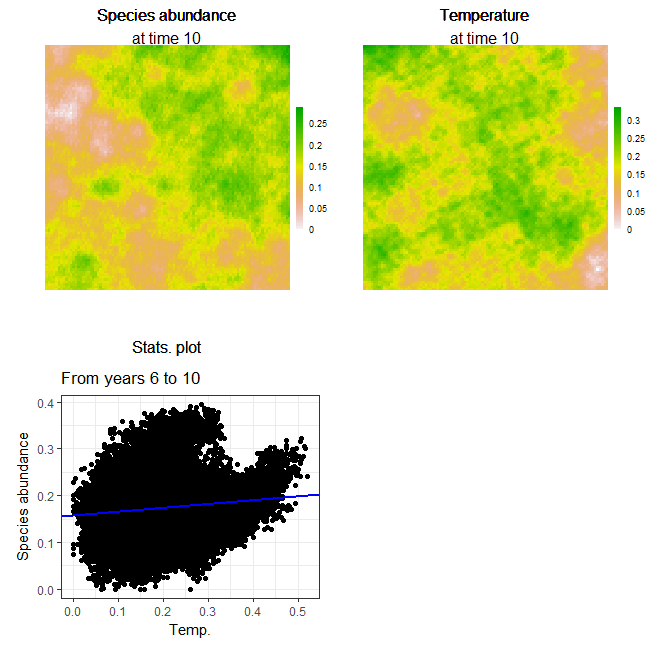

```{r setup, include=FALSE}
knitr::opts_chunk$set(cache = 2)
```

## a VERY simple example of **`SpaDES`** awesomeness
This guide will take you through how to start your own model using **`SpaDES`**. It assumes you have already installed **`SpaDES`** and that it is working in your machine. If you haven't done this yet, please have a look at [this gist](https://gist.github.com/tati-micheletti/1de7505cdd387fe997f127f13eeb4393) to bypass known issues.


### THE EXAMPLE
Let's imagine we want to understand whether the abundance of a species is statistically related with temperature. Both the abundance data and the temperature data are being constantly updated. Also, we want to have the possibility of analysing the relationship between the two iteratively, without needing to constantly change our script to account for the new data inputs.
In this example the abundance and temperature data are being updated by a simulation model.


### BEFORE `SpaDES`...
If we use R to develop our species abundance and temperature simulation models in the 'conventional way', we'll probably have a script where everything happens - the simulations and data analysis. At most, we would have a main script that sources others that contain useful functions, or are doing the simulations and data treatment/analysis separately. If you already use R like this, you'll find that the **`SpaDES`** way of thinking is similar. So why use it? Because it makes changing, adapting and sharing your code - or modules - much easier. 

Still don't believe me? Okay, let's solve our problem using the conventional way:

#### Setup
Load the necessary packages
```{r loadPkgs, message = FALSE, warning = FALSE}
library(raster)
library(quickPlot)
library(ggplot2)
library(SpaDES.tools)
library(SpaDES.core)
```

And now create a raster template:
```{r the_r_way_raster, message = FALSE, warning = FALSE}
r <- raster(nrows = 100, ncols = 100, xmn = -50, xmx = 50, ymn = -50, ymx = 50)
```

#### Species abundance "simulations"
Our VERY simple "simulation" model (in form of a function) generates rasters that follow a Gaussian distribution
```{r the_r_way_simulation_function_AB}
abundance_model <- function(ras, Time) {
  abund_outputs <- list()
  for(t in 1:Time) { 
    abund_outputs[[t]] <- gaussMap(ras, scale = 100, var = 0.03) 
  }
  return(abund_outputs)
}
```

Set the length of the simulation (or simply the number of model iterations), run it and plot results (all ABUNDANCE plots together):
```{r the_r_way_simulation_length, message=FALSE}
Time <- 10
abundance <- abundance_model(r = r, Time = Time)
dev()
plot(stack(abundance))
```

#### Temperature "simulations"
The temperature simulation model will be similar to the vegetation one - remember this is a dummy example ;)
```{r the_r_way_simulation_function_TMP}
temp_model <- function(r, Time) {
  temp_outputs <- list()
  for(t in 1:Time) { 
    temp_outputs[[t]] <- gaussMap(r, scale = 100, var = 0.1) 
  }
  return(temp_outputs)
}
```

Run the model and plot results (all TEMPERATURE plots together)
```{r the_r_way_plot_results_TMP}
temperature <- temp_model(r = r, Time = Time)
plot(stack(temperature))
```

#### Data analysis
Now we analyse if species abundance and temperature are correlated.  
First we create the data analysis function (a simple linear model):
```{r data_analysis_model}
stats_analysis <- function(Data){
  if(all(c("abund", "temp") %in% colnames(Data))) {
    lm1 <- lm(abund ~ temp, data = Data)
    ggplot(Data) + 
    geom_point(aes(x = temp, y = abund)) +
    geom_abline(intercept = lm1$coefficients["(Intercept)"], 
                slope = lm1$coefficients["temp"], size = 2, col = "blue") +
    theme_bw() +
    labs(x = "Temp.", y = "Species abundance")
    
  } else {
    stop("Data must contain 'abund' and 'temp' columns")
  }
}
```

Then we create a loop to analyse each plot of our time-series:
```{r data_analysis, echo=-1}
par(mfrow = c(2, 5)) # This plots in 2 lines and 4 columns
for(t in 1:Time){
  outputdata <- data.frame(abund = abundance[[t]][], temp = temperature[[t]][])
  stats_analysis(Data = outputdata)
}
```

That's it. You have your model. But what if you need to include new data? You would have to manually change the code for it... 

### AFTER  `SpaDES`...

#### The "global" script (i.e. controller script for simulation)

Let's now solve the same problem using the **`SpaDES`** approach. I like to start by creating a *global.R* script (you can call it whatever you want, though) that will load the **`SpaDES`** libraries and run **`SpaDES`** simulations. The *global.R* script for this dummy example can be found on the root of SpaDES4Dummies Project. Note that we can also use *.Rmd* scripts to do this - I just happen to prefer *.R* scripts.

```{r globalscript, results = FALSE, message = FALSE, warning = FALSE}
library(SpaDES)  ## should automatically download all packages in the SpaDES family and their dependencies

## Let's create a self-contained module that will simulate the species' abundance for any given period of time and frequency.
if(!dir.exists(file.path(getPaths()$modulePath, "speciesAbundance"))){
  newModule(name = "speciesAbundance", path = getPaths()$modulePath)
}
```

You will notice that `newModule` has created a module folder (`speciesAbundance`) inside */modules* that contains both the module *.R* script template, as well as the documentation template (the *.Rmd* file). Although we will not be discussing the *.Rmd* file, please bear in mind that this is a **fundamental** part of creating a reproducible and transparent module - check out the [Guide to Reproducible Code in Ecology and Evolution](http://www.britishecologicalsociety.org/wp-content/uploads/2017/12/guide-to-reproducible-code.pdf) from the British Ecological Society). The documentation should contain not only the description of the module, but also some simple examples of what it can do.

`newModule` also created the folder */data* where data necessary to the module should be put in, and the folder */tests* that may contain testing scripts. We won't be using either of them in this example. 

**/!\\ Attention /!\\** : `newModule` should only be run once, or separately in the console, otherwise you may lose your module edits by re-running it again - this is why I wrapped it in an `if` statement (smart eh?).

Now go ahead, open the *speciesAbundance.R* script and check it out a little bit.

***

#### General module structure: `speciesAbundance` module

I know, I know... It seems confusing and there's a lot of stuff in that template! But I will describe it step by step. We'll go through it step by step (although not necessarily following the order of the script). The module script can be divided into 4 parts: 

**[Defining the Module](#anchor1):** this is where you **define** your module (or the module's metadata) (e.g. module author(s), time units, basic parameters, general inputs and outputs, etc.);  
**[Event functions](#anchor2):** these are the "actions" (or events) that will happen in your module (i.e. species reproduction, plotting, saving parameters) - simply put, **WHAT** the module will do;  
**[Scheduling Events](#anchor3):** this is how SpaDES schedules when each event is going to happen - in which order (e.g. during the simulation, when will SpaDES plot a graph) - simply put, **WHEN** the module will do;  
**[Additional functions](#anchor4):** any additional functions needed (e.g. this is used to keep the coding of your module as clear and straightforward as possible);  
**[`.inputObjects` function](#anchor5):** this is where the model developer will make sure that default inputs objects are loaded/created when they are not being provided by the user. 

The first thing you need to know is that **you won't need to run** any of the code inside a module's *.R* script. The function `simInit` will "call" your model when it sets up the simulation. But don't worry about `simInit` yet, you will see this later in detail. So let's go through the module *.R* script together.  

##### **Defining the Module** {#anchor1}

The first "bit" of the code is basically defining the module's [metadata](http://data-informed.com/what-is-metadata-a-simple-guide-to-what-everyone-should-know/). It will allow you to define the module's author, keywords, any required packages and module(s) and their versions. It will also define parameters and inputs that the module requires, and the outputs it produces.

Although this dummy module example requires no true input data, we will defined the template raster `r` as an "input" in the `expectsInput` function, and provide a default object in `.inputObjects` (see below). As for the outputs, it produces a list of abundance rasters (produced during the `abundanceSim` event). So we define it as an output in the`createsOutput` function.

If you compare this dummy module to a template created by the `newModule` function, you'll notice that several parameters that we don't need for our dummy example were removed (like `save parameters`).

If you are unsure of what input and output parameters are in the context of a module, a good rule of thumb is that inputs are all the `sim$...` objects that appear for the first time on the **right-hand side** of a `<-`, whereas output parameters are the `sim$...` objects that appear for the first time to the **left-hand side** of a `<-`. Another way of explaining it for objects ("obj"):


The exception to this rule (what are rules without exceptions, eh?) are the default input objects that are created by the [`.inputObjects` function](#anchor5) during the `simInit`call. 

Here's how I defined the module:
```{r abund_module, eval=FALSE}
defineModule(sim, list(
  name = "speciesAbundance",
  description = "Species abundance simulator",
  keywords = c("species", "abundance", "gaussian", "spatial","dummy example"),
  authors = person("Mr.", "Me", email = "mr.me@example.com", role = c("aut", "cre")),
  childModules = character(0),
  version = list(SpaDES.core = "0.1.1.9011", speciesAbundance = "0.0.1"),
  # spatialExtent = raster::extent(rep(NA_real_, 4)),
  timeframe = as.POSIXlt(c(NA, NA)),
  timeunit = "year",
  citation = list("citation.bib"),
  documentation = list("README.txt", "speciesAbundance.Rmd"),
  reqdPkgs = list("raster", "quickPlot"),
  parameters = rbind(
    # defineParameter("paramName", "paramClass", value, min, max, "parameter description"),
    defineParameter("simulationTimeStep", "numeric", 1, NA, NA, "This describes the simulation time step interval"),
    defineParameter(".plotInitialTime", "numeric", 1, NA, NA, "This describes the simulation time at which the first plot event should occur"),
    defineParameter(".plotInterval", "numeric", 1, NA, NA, "This describes the simulation time interval between plot events")
  ),
  inputObjects = bind_rows(
    # expectsInput("objectName", "objectClass", "input object description", sourceURL, ...),
    expectsInput("r", objectClass = "RasterLayer", desc = "Template raster")
  ),
  outputObjects = bind_rows(
    #createsOutput("objectName", "objectClass", "output object description", ...),
    createsOutput("abundRasters", "list", "List of layers of species abundance at any given year")
  )
))
```
Note that the package versions that you define will depend on the ones that are installed on your computer. So take care to changed them accordingly.

The rest of the script defines the events and their sequences for this module - remember **`SpaDES`** = Spatial Discrete Event Simulator - and the events themselves.

##### **Event functions** {#anchor2}

Since we are only interested in simulating and plotting species abundances, we can remove unnecessary events from the script. Only 3 events were kept: the initialisation, an abundance simulation event and a plotting event.

Let's look at the **event functions** (`doEvent.moduleName`, in our dummy example, `doEvent.speciesAbundance` function) first. The event functions were renamed from the template as to reflect my module's actions. Therefore, `Init` became `abundanceInit`, `Plot` became `abundancePlot` and `event1` became `abundanceSim`.

###### *Initialisation event function* 

The initialisation (`init`) event can be seen as the starting point of the module, and is **mandatory**. The other `events` are not. **`SpaDES`** knows how to deal with an `init` event and "searches" for it before doing anything else.

In the initialisation of our dummy example, we are creating a template raster and a storage list for our species abundance outputs (which will also be rasters). Notice how the only argument to `abundanceInit` is the `sim` object, which is where the objects being created are stored. Always take care to `return()` the `sim` object at the end of an event.
```{r abund_module_SpaDES, eval = FALSE}
abundanceInit <- function(sim) {
  ## create storage list of species abundance
  sim$abundRasters <- list()
  
  return(invisible(sim))
}
```

###### *Abundance simulation event function*

This event is basically the 'prima donna' of this module. This is where we will generate species abundances. Notice how instead of a loop, we now have the event running the `abundance_model` function (which we'll define separately below) and storing its outputs in the `sim$abundRaster` object. Notice as well that we use `time(sim)` as the identifier of the list slots where outputs are stored. Go ahead and check what `SpaDES.core::time` is doing!
Again, the sole argument and output to this event function is the `sim` object - notice a pattern? ;)
```{r abund_module3, eval = FALSE}
abundanceSim <- function(sim) {
  ## Generate species abundances - our "simulation"
  sim$abundRasters[[as.character(time(sim))]] <- abundance_model(ras = sim$r)
  
  return(invisible(sim))
}
```

###### *Plotting event function*

What does this event do? Yup, you got it. This event simply plots the species abundance rasters that are produced during the `abundanceSim` event. Shall we have a look?
```{r abund_module4, eval = FALSE}
abundancePlot <- function(sim) {
  ## plot abundances
  plotTitle <- paste("Species abundance\nat time",
                      names(sim$abundRasters)[length(sim$abundRasters)])
  abundPlot <- sim$abundRasters[[length(sim$abundRasters)]] 
  Plot(abundPlot, 
       title = plotTitle, 
       new = TRUE, addTo = "abundPlot")
  
  return(invisible(sim))
}
```

"It looks great, but... How does it know that it should plot them **after** the abundance generator?" you ask, puzzled. Good question sir/madam, 5 points for Griffindor!

##### **Scheduling events** {#anchor3}

The order in which each of the *modules* (and consequently their initialisations) are executed is automatically determined by inter-module dependencies (i.e. module inputs that are the outputs of other modules). After all, we don't want the plotting to occur before the generation of species abundances. If there are no inter-module dependencies the order is determined by the other in which the modules are listed in the *global.R* script **and/or** by the way we schedule the events - I told you **`SpaDES`** is cool!

So let's go back to our dummy example. Now that we've defined our event functions, we need to set the order in which they will happen for this module. For example, we don't want the plotting to occur before the generation of species abundances, so we'll schedule all `abundancePlot` events to occur slightly after the `abundanceSim` events, by changing event priority (see `?priority`). Scroll up to the `doEvent.speciesAbundance` function, where you'll schedule events. Here's how I've configured mine:

```{r abund_module5, eval = FALSE}
doEvent.speciesAbundance = function(sim, eventTime, eventType, debug = FALSE) {
  switch(
    eventType,
    init = {
      ## do stuff for this event
      sim <- abundanceInit(sim)
      
      ## schedule future event(s)
      sim <- scheduleEvent(sim, eventTime = start(sim), moduleName = "speciesAbundance", 
                           eventType = "SimulAbund")
      sim <- scheduleEvent(sim, eventTime = P(sim)$.plotInitialTime, 
                           moduleName = "speciesAbundance", eventType = "abundPlot",
                           eventPriority = .normal()+0.5)
    },
    SimulAbund = {
      ## do stuff for this event
      sim <- abundanceSim(sim)
      
      ## schedule future event(s)
      sim <- scheduleEvent(sim, eventTime = time(sim) + P(sim)$simulationTimeStep, 
                           moduleName = "speciesAbundance", eventType = "SimulAbund")
    },
    abundPlot = {
      ## do stuff for this event
      sim <- abundancePlot(sim)
      
      ## schedule future event(s)
      sim <- scheduleEvent(sim, eventTime = time(sim) + P(sim)$.plotInterval, 
                           moduleName = "speciesAbundance", eventType = "abundPlot", 
                           eventPriority = .normal()+0.5)
    },
    warning(paste("Undefined event type: '", current(sim)[1, "eventType", with = FALSE],
                  "' in module '", current(sim)[1, "moduleName", with = FALSE], "'", sep = ""))
  )
  return(invisible(sim))
}
```
Now this one seems complicated... But it's not, trust me. Let's go step by step.

I encourage you to start checking what `base::switch` is doing on your own, but if you can't wait to know it, here's a short explanation: `base::switch` tells **R** that the behaviour of your function will change (or switch) depending on the value of `eventType`. So we need to define the behaviour of `doEvent` for all the event types we have in this module. In each of them we will execute the event functions and schedule the future events with `scheduleEvent`.

###### **init**
The first event is, obviously, `init` - **don´t change the name of this one**. 
In `init` we run the initialisation event function (`abundanceInit`) and schedule the abundance simulation (`SimulAbund`) and plotting (`abundPlot`) events. The `init` for the plotting events will be executed at the time defined by the `.plotInitialTime` parameter, which is stored in the `sim` object (and obtained using `SpaDES.core::P()`). Notice that the `SimulAbund` event will be scheduled at `start(sim)` (i.e. at the starting time of the simulation), which mean it will run after the `init` event, but still in the same "year".

###### **SimulAbund**
The `SimulAbund` type is defined next. During this event, the species' abundances will be generated using the `abundanceSim` function. 
It also it **schedules itself** to occur at a frequency defined by the `simulationTimeStep` parameter - isn't that cool?

###### **abundPlot**
Finally, we scheduling and the plotting event, `abundPlot`. It is similar to the `SimulAbund` event, with an important difference being that it uses the `.plotInterval` parameter to re-schedule itself.


**Note:** Notice how I've scheduled future events to `time(sim) + P(sim)$simulationTimeStep` or `time(sim) + P(sim)$.plotInterval`. This way, future events will occur depending on the time step and plot interval defined in your global script. Also, try to **never** to have events schedule *other* events (except for `init` which has to schedule the first instances of each other event) - this breaks event modularity.

###### **Additional functions** {#anchor4}

Ok, just one more bit left. Events may also rely on other functions that can either be sourced from other scripts, or defined at the end of the module script. This is the case for the species abundances generator function, which I have coded in a separate script called *abundance_model.R*. Scripts with accessory functions like these go into module's *R/* folder. 

Note that I have added the decription of the function it's parameters, returning value and what other package functions it relies on following the R-package documentation style.

```{r abund_module7, eval = FALSE}
#' Accessory function to speciesAbundance module

#' @param ras a raster layer used as template.
#' @return a fake abundance raster generated as a Gaussian map with scale = 100 and variance = 0.01
#' @import SpaDES.tools gaussMap 
abundance_model <- function(ras) {
  abund_ras <- gaussMap(ras, scale = 100, var = 0.01) 
  return(abund_ras)
}
```

##### **`.inputObjects` function** {#anchor5}

OK, just one more thing left. You'll notice that at the end of the template `.R` script there is a function called `.inputObjects`.
This is where the developer will include code to produce, or load, any input objects that can be overridden by the user - thus providing their defaults. It would be an ideal place to produce the `r` template raster, instead of in `abundanceInit`, as it would offer a future user the possibility of externally providing their own `r` template (e.g. for another study area) - which at this moment would be overridden by the execution of the `init` event.
Here's an example of how to do this (the commented instructions have been deleted):

```{r abund_model6, eval = FALSE}
.inputObjects <- function(sim) {
  if(!suppliedElsewhere(sim$r)) {
    ## make template raster if not supplied elsewhere.
    sim$r <- raster(nrows = 100, ncols = 100, xmn = -50, xmx = 50, ymn = -50, ymx = 50)
  }
  return(invisible(sim))
}
```

**/!\\ ATTENTION /!\\**
Make sure you **add `r` in the module metadata in an `expectsInput` call**.
As a module developer you should also try to provide default input objects in the remaining modules, so that they can work "alone". You will notice, that I have done this below.


***

#### Creating additional modules: `temperature` module

Now let's go ahead and repeat the previous steps to create a second module that will generate yearly temperatures.

Apart from changing the objects and functions names, I have also included the template raster `r` as an input object for the temperature module - remember that `r` is created during the `.inputObjects` of the `speciesAbundance` module. If the two modules are linked, this object will not be created twice because `suppliedElsewhere("r", sim)` will tell the second module that `r` is already available in the `simList` (called `sim` inside the modules). This may not seem like a big deal in our example, but it can be if you're generating heavy objects, or relying on functions that take a while to run.

Here's how my final *temperature.R* script looks like:

```{r temp_module, eval = FALSE}
defineModule(sim, list(
  name = "temperature",
  description = "Temperature simulator",
  keywords = c("temperature", "gaussian", "spatial"),
  authors = person("Mr.", "Me", email = "mr.me@example.com", role = c("aut", "cre")),
  childModules = character(0),
  version = list(SpaDES.core = "0.1.1.9011", speciesAbundance = "0.0.1"),
  # spatialExtent = raster::extent(rep(NA_real_, 4)),
  timeframe = as.POSIXlt(c(NA, NA)),
  timeunit = "year",
  citation = list("citation.bib"),
  documentation = list("README.txt", "temperature.Rmd"),
  reqdPkgs = list("raster"),
  parameters = rbind(
    #defineParameter("paramName", "paramClass", value, min, max, "parameter description"),
    defineParameter("simulationTimeStep", "numeric", 1, NA, NA, 
                    "This describes the simulation time step interval"),
    defineParameter(".plotInitialTime", "numeric", 1, NA, NA, 
                    "This describes the simulation time at which the first plot event should occur"),
    defineParameter(".plotInterval", "numeric", 1, NA, NA,
                    "This describes the simulation time interval between plot events")
  ),
  inputObjects = bind_rows(
    #expectsInput("objectName", "objectClass", "input object description", sourceURL, ...),
    expectsInput("r", "RasterLayer", "Template raster")
  ),
  outputObjects = bind_rows(
    #createsOutput("objectName", "objectClass", "output object description", ...),
    createsOutput("tempRasters",  "list", "List of raster layers of temperature at any given year")
  )
))

## event types
#   - type `init` is required for initialiazation

doEvent.temperature = function(sim, eventTime, eventType, debug = FALSE) {
  switch(
    eventType,
    init = {
      ## do stuff for this event
      sim <- temperatureInit(sim)
      
      ## schedule future event(s)
      sim <- scheduleEvent(sim, eventTime = start(sim), moduleName = "temperature", eventType = "SimulTemp")
      sim <- scheduleEvent(sim, eventTime = P(sim)$.plotInitialTime, moduleName = "temperature", 
                           eventType = "tempPlot", eventPriority = .normal()+0.5)
    },
    SimulTemp = {
      ## do stuff for this event
      sim <- temperatureSim(sim)
      
      ## schedule future event(s)
      sim <- scheduleEvent(sim, eventTime = time(sim)+ P(sim)$simulationTimeStep, moduleName = "temperature", 
                           eventType = "SimulTemp")
    },
    tempPlot = {
      ## do stuff for this event
      sim <- temperaturePlot(sim)

      ## schedule future event(s)
      sim <- scheduleEvent(sim, eventTime = time(sim) + P(sim)$.plotInterval, moduleName = "temperature", 
                           eventType = "tempPlot", eventPriority = .normal()+0.5)
    },
    warning(paste("Undefined event type: '", current(sim)[1, "eventType", with = FALSE],
                  "' in module '", current(sim)[1, "moduleName", with = FALSE], "'", sep = ""))
  )
  return(invisible(sim))
}

## This is the 'init' event:
temperatureInit <- function(sim) {
  ## create storage list of species temperature
  sim$tempRasters <- list()
  
  return(invisible(sim))
}

## This is the temperature simulation event function
temperatureSim <- function(sim) {
  ## Generate temperature - our "updated data"
  sim$tempRasters[[as.character(time(sim))]] <- temperature_model(ras = sim$r)
  
  return(invisible(sim))
}

## This is the plotting event funciton
temperaturePlot <- function(sim) {
  ## plot temperature
  plotTitle <- paste("Temperature\nat time",
                      names(sim$tempRasters)[length(sim$tempRasters)])
  tempPlot <- sim$tempRasters[[length(sim$tempRasters)]] 
  Plot(tempPlot, 
       title = plotTitle, 
       new = TRUE, addTo = "tempPlot")
  
  return(invisible(sim))
}

.inputObjects <- function(sim) {
  if(!suppliedElsewhere(sim$r)) {
    ## make template raster if not supplied elsewhere.
    sim$r <- raster(nrows = 100, ncols = 100, xmn = -50, xmx = 50, ymn = -50, ymx = 50)
  }
  return(invisible(sim))
}
```

Again, the accessory `temperature_model` function is coded in a separate script *R/temperature_model.R*:

```{r temp_module2, eval = FALSE}
#' Accessory function to temperature module

#' @param ras a raster layer used as template.
#' @return a fake temperature raster generated as a Gaussian map with scale = 100 and variance = 0.01
#' @import SpaDES.tools gaussMap 

temperature_model <- function(ras) {
  temp_ras <- gaussMap(ras, scale = 100, var = 0.01) 
  return(temp_ras)
}
```


***

#### Modules that depend on other modules: the `speciesTempLM` module

Our third and last module will be used to run the statistical analysis at each year, after the abundances and temperatures are generated.
Hence, it'll depend on the outputs of the `speciesAbundance` and the `temperature` modules. We'll call it `speciesTempLM` (**species** and **Temp**erature **L**inear **M**odel).  

The interest of keeping the statistical analysis in a separate module lies on the fact that it allows us to easily swap and compare different statistical models to analyse our data if we want to.   

It also allows for greater flexibility when it comes to **when** the statistical model is supposed to run. For example, imagine that instead of every year, we want to fit it at every 5 years, using the previous 5 years of data. By having the statistical analysis contained in its own module, we don't need to fiddle with the other module scripts in order to make these changes.

Finally, I'd like to draw your attention to a few differences in this module's script before we see it:

* The **frequency** of the statistical analysis (and correspondent plots) will be determined by the parameter `statsTimestep`. This parameter also determines the number of data years to be used to fit the linear model. If `statsTimestep` = 5, then the statistical analysis will use the precedent 5 years of data including the year in which the event is running (a total of 6 years of data);

* This module **requires inputs**. They are specified in `inputObjects` part of `defineModule` - notice how I've respected the names, classes and description of the objects that come from the `speciesAbundance` and the `temperature` modules;

* This time, we have **two additional functions** in a separate script (*R/linear_model_functions.R*): the function fitting the linear model and a plotting function.

Here's the full module's script.
Notice how the future events where scheduled to `P(sim)$statsTimestep + 0.1`. This forces the statistic analyses to occur **after** the abundance and temperature rasters are ready.

```{r stats_module, eval = FALSE}
defineModule(sim, list(
  name = "speciesAbundance",
  description = "",
  keywords = "",
  authors = structure(list(list(given = c("First", "Middle"), family = "Last", role = c("aut", "cre"), email = "email@example.com", comment = NULL)), class = "person"),
  childModules = character(0),
  version = list(SpaDES.core = "0.1.1.9011", speciesAbundance = "0.0.1"),
  # spatialExtent = raster::extent(rep(NA_real_, 4)),
  timeframe = as.POSIXlt(c(NA, NA)),
  timeunit = "year",
  citation = list("citation.bib"),
  documentation = deparse(list("README.txt", "speciesAbundance.Rmd")),
  reqdPkgs = list("raster", "quickPlot"),
  parameters = rbind(
    #defineParameter("paramName", "paramClass", value, min, max, "parameter description"),
    defineParameter("simulationTimeStep", "numeric", 1, NA, NA, 
                    "This describes the simulation time step interval"),
    defineParameter(".plotInitialTime", "numeric", 1, NA, NA,
                    "Describes the simulation time at which the first plot event should occur."),
    defineParameter(".plotInterval", "numeric", 1, NA, NA,
                    "Describes the simulation time interval between plot events.")
  ),
  inputObjects = bind_rows(
    # expectsInput("objectName", "objectClass", "input object description", sourceURL, ...),
    expectsInput("r", objectClass = "RasterLayer", desc = "Template raster")
  ),
  outputObjects = bind_rows(
    #createsOutput("objectName", "objectClass", "output object description", ...),
    createsOutput("abundRasters", "list", "List of layers of species abundance at any given year")
  )
))

## event types
#   - type `init` is required for initialization

doEvent.speciesAbundance = function(sim, eventTime, eventType, debug = FALSE) {
  switch(
    eventType,
    init = {
      ## do stuff for this event
      sim <- abundanceInit(sim)
      
      ## schedule future event(s)
      sim <- scheduleEvent(sim, eventTime = start(sim), moduleName = "speciesAbundance", 
                           eventType = "SimulAbund")
      sim <- scheduleEvent(sim, eventTime = P(sim)$.plotInitialTime, 
                           moduleName = "speciesAbundance", eventType = "abundPlot",
                           eventPriority = .normal()+0.5)
    },
    SimulAbund = {
      ## do stuff for this event
      sim <- abundanceSim(sim)
      
      ## schedule future event(s)
      sim <- scheduleEvent(sim, eventTime = time(sim) + P(sim)$simulationTimeStep, 
                           moduleName = "speciesAbundance", eventType = "SimulAbund")
    },
    abundPlot = {
      ## do stuff for this event
      sim <- abundancePlot(sim)
      
      ## schedule future event(s)
      sim <- scheduleEvent(sim, eventTime = time(sim) + P(sim)$.plotInterval, 
                           moduleName = "speciesAbundance", eventType = "abundPlot", 
                           eventPriority = .normal()+0.5)
    },
    warning(paste("Undefined event type: '", current(sim)[1, "eventType", with = FALSE],
                  "' in module '", current(sim)[1, "moduleName", with = FALSE], "'", sep = ""))
  )
  return(invisible(sim))
}

## event functions
#   - keep event functions short and clean, modularize by calling subroutines from section below.

## Initialisation Event function
abundanceInit <- function(sim) {
  ## create storage list of species abundance
  sim$abundRasters <- list()
  
  return(invisible(sim))
}

## Abundance simulation event function
abundanceSim <- function(sim) {
  ## Generate species abundances - our "simulation"
  sim$abundRasters[[as.character(time(sim))]] <- abundance_model(ras = sim$r)
  
  return(invisible(sim))
}

## Plotting event function 
abundancePlot <- function(sim) {
  ## plot abundances
  plotTitle <- paste("Species abundance\nat time",
                      names(sim$abundRasters)[length(sim$abundRasters)])
  abundPlot <- sim$abundRasters[[length(sim$abundRasters)]] 
  Plot(abundPlot, 
       title = plotTitle, 
       new = TRUE, addTo = "abundPlot")
  
  return(invisible(sim))
}


.inputObjects <- function(sim) {
  if(!suppliedElsewhere(sim$r)) {
    ## make template raster if not supplied elsewhere.
    sim$r <- raster(nrows = 100, ncols = 100, xmn = -50, xmx = 50, ymn = -50, ymx = 50)
  }
  return(invisible(sim))
}


```

And the script with the accessory functions:

```{r stats_module2, eval = FALSE}
## Accessory functions to speciesTempLM module

#' Accessory function to speciesTempLM module that calculates a
#'  linear regression between species abundances and temperature
#'
#' @param Data a data.frame or data.table that contains an \code{abund}
#'   column and a \code{temp} column with abundance and temperature values 
#'   in each location, respectively.
#' @return a linear model (\code{lm}) object fitted with the formula:
#'  \code{abund ~ temp}

linearModel <- function(Data){
  return(lm1 <- lm(abund ~ temp, data = Data))
}
```

***

### Let's play!

#### Simulation setup in "global" script

OK, now that we have our modules ready we can set up the simulation. Let's go back to our *global.R* script.  

The function `simInit` will take a bunch of parameter lists and will prepare a simulation object that can later be run by the `spades` function. Let's see what these lists consist of:

The first list, `modules`, contains modules we want to activate.

Then, `times` is a list containing the start and end times of the simulation and what time units we're working with - so it defines the length of the simulation. It's important that the start and ending times are defined in decimals, because **`SpaDES`** allows decomposing time units into smaller fractions - and we'll take advantage of this feature!

`parameters` is a list of lists. It contains the values of parameters used by each modules. Note that not all module parameters need to be defined in this way. In fact, a module can use a parameter that is listed inside the module *.R* script (and has a default value set there), but is never listed in the `simInit`. An example of this would be `.plotInterval` which is used and defined in the `speciesAbundance` and `temperature` modules, but not passed to the `simInit` function. Conversely, `.plotInitialTime` is a parameter used and defined in these modules, but whose value we pass when running `simInit` (try changing the value ;)).  

Finally, `paths` contains the directory paths that we set earlier.

```{r globalscript2, results=FALSE, warning=FALSE, message=FALSE}
## list the modules to use
simModules <- list("speciesAbundance", "temperature", "speciesTempLM")

## Set simulation and module parameters
simTimes <- list(start = 1, end = 10, timeunit = "year")
simParams <- list(
  speciesAbundance = list(simulationTimeStep = 1, 
                     .plotInitialTime = 1),
  temperature = list(simulationTimeStep = 1, 
                     .plotInitialTime = 1),
  speciesTempLM = list(statsTimestep = 5)
)

## make a list of directory paths
simPaths <- list(cachePath = "cache",
                 inputPath = "inputs",
                 modulePath = "modules",
                 outputPath = "outputs")

## Simulation setup
mySim <- simInit(times = simTimes, params = simParams, 
                 modules = simModules, paths = simPaths)
```

##### Have you set up your simulation correctly?

Before starting the simulations we should check if the modules were linked correctly.

**Module diagram**

`moduleDiagram` is a useful function that shows module inter-dependencies as a network. The direction of the arrows indicates an output to input flow. You can see that an output from `speciesAbundance` (specifically our `r` raster) is an input for `temperature`. In a similar way, the outputs of the `speciesAbundance` and `temperature` modules are inputs to the `speciesTempLM` module.

```{r modulediagram, echo = -1, fig.height=10,fig.width=10}
clearPlot()
moduleDiagram(mySim)
```

**Object diagram**

`objectDiagram` provides a way of checking if the modules are linked correctly, by explicitly showing module inter-dependencies, depicting the objects that establish links between modules.
```{r eventdiagram}
objectDiagram(mySim)
```

##### Run **`SpaDES`**!

OK, everything seems to be correct so far. Let's try to run the simulations. 
I have used `debug = TRUE` so that `spades` prints the events as they are being executed. In case something fails, we'll know where it stopped.

```{r spadesrun, eval = FALSE}
## run simulation
dev() # on Windows and Mac, this opens external device if using Rstudio, it is faster
clearPlot()
mySim2 <- spades(mySim, debug = TRUE)
```



Try now playing around with other models, parameters and new modules to further explore all the `SpaDES` flexibility! The more complex your project gets, the easier it is to turn *on* and *off* different modules, run different statistical analysis, and include more data  when using `SpaDES` than before!  


<center> **Happy SpaDESing!** </center>


***

### Additional notes

**`SpaDES`** is an extremely powerful package, whose potential goes well beyond what has been discussed in this dummy example. If you don't feel so dummy anymore and want to explore it further, have a look at the [LCC2005](https://github.com/PredictiveEcology/SpaDES-modules/blob/master/modules/LCC2005/LCC2005.Rmd) and the [wolfALps](https://htmlpreview.github.io/?https://github.com/PredictiveEcology/SpaDES-modules/blob/master/modules/wolfAlps/wolfAlps.html) module tutorials. Also, do go to the [**`SpaDES`** webpage](http://predictiveecology.org/) to find further information about the platform, as well as upcoming workshops and publications.  


