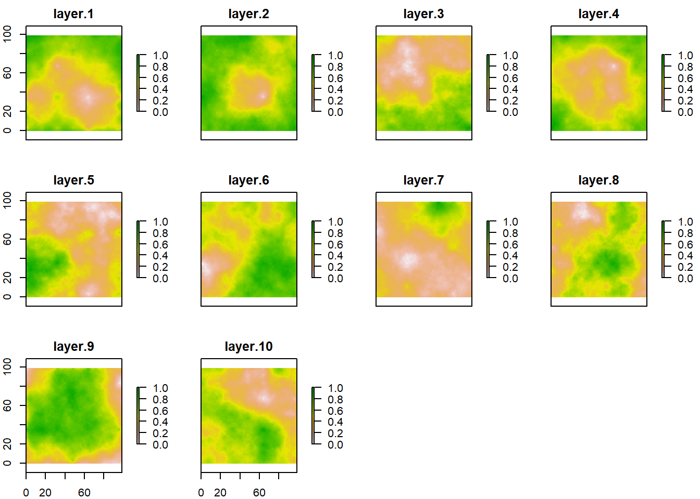
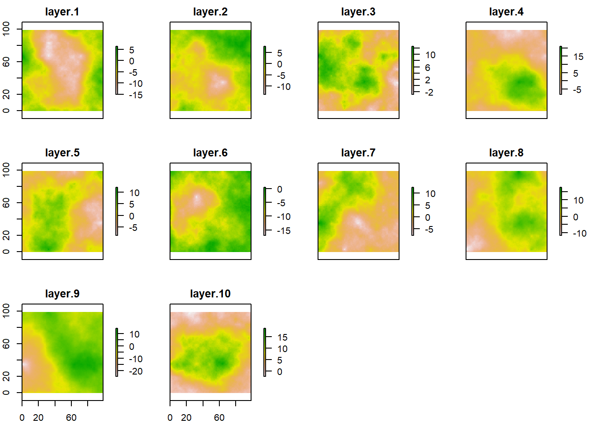
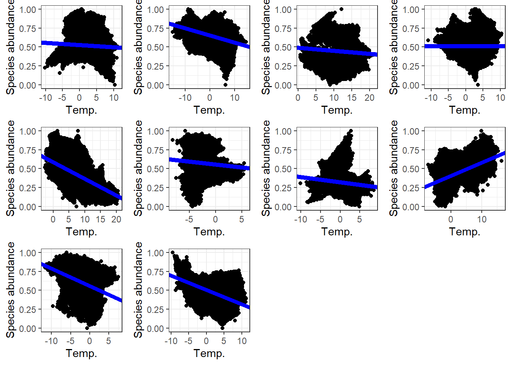

# Introducing `SpaDES` with a dummy ecological model {#part1}

Authors: Ceres Barros, Tati Micheletti


Let's imagine we want to explore how the relationship between a species' abundance and temperature changes over time.
Both the abundance data and the temperature data are being constantly updated by a simulation model, and we want to analyse the relationship between the two iteratively, without needing to manually run a script to account for the newly generated data inputs.

## BEFORE `SpaDES`...

If we use R to develop our species abundance and temperature simulation models in the 'conventional way', we'll probably have i) (the worst case scenario) several scripts that run simulations and data treatment/analysis separately and have to be executed manually, or ii) a long script where everything happens - the simulations and data analysis -, iii) a main script that sources others that do the simulation and analyses.
Option i is more common when different software are used for different parts of the process (e.g., a simulation model in *C++* generates data that is then analysed in R).
Option ii is inconvenient because very long scripts make changes and updates to the script - debugging can also be more tiresome.
Option iii, is similar to the `SpaDES` way of thinking.
The difference is that `SpaDES` defines a standard way of writing different components of a model, or of a modelling framework.
This makes changing, updating and sharing code - or modules - easier, as well as swapping and adding modules in a modelling framework.

The example below is so minimal that it is unlikely to show the full benefits of using `SpaDES` - the same could be accomplished with a fairly short script.
However, it introduces the different parts of a module and how to link modules.

Part \@ref(part2) goes a step further and uses real datasets to project species presences across a landscape in Canada.
In Part \@ref(part2), we introduce `SpaDES` features that we most commonly use in our work (e.g., caching and spatial data processing) and provide some coding best practices that we use ourselves (e.g., code assertions).

### Setup

This is what you'd normally do... Install all the packages in some way that you probably didn't record in your scripts and then start your script with loading the packages:


```{.r .fold-show}
## please start from a clean R session
remotes::install_github("ropensci/NLMR")  ## you will need this ;)

library(raster)
library(quickPlot)
library(ggplot2)
library(SpaDES.tools)
library(ggpubr)
```

And now create a raster template:


```{.r .fold-show}
r <- raster(nrows = 100, ncols = 100, xmn = -50, xmx = 50, ymn = -50, ymx = 50)
```

### Species abundance "simulations"

Our VERY simple "simulation" model (in form of a function) generates rasters that follow a Gaussian distribution


```{.r .fold-show}
abundance_model <- function(ras, Time) {
  abund_outputs <- list()
  for (t in 1:Time) { 
    abund_outputs[[t]] <- NLMR::nlm_mpd(
      ncol = ncol(ras),
      nrow = nrow(ras),
      resolution = unique(res(ras)),
      roughness = 0.5, 
      rand_dev = 100,
      rescale = TRUE,
      verbose = FALSE
    )
  }
  return(abund_outputs)
}
```

Set the length of the simulation (or simply the number of model iterations), run it and plot results (all ABUNDANCE plots together):


```{.r .fold-show}
Time <- 10
abundance <- abundance_model(ras = r, Time = Time)
dev()
plot(stack(abundance))
```



### Temperature "simulations"

The temperature simulation model will be similar to the vegetation one - remember this is a dummy example.


```{.r .fold-show}
temperature_model <- function(ras, Time) {
  temp_outputs <- list()
  for (t in 1:Time) { 
    temp_outputs[[t]] <- NLMR::nlm_mpd(
      ncol = ncol(ras),
      nrow = nrow(ras),
      resolution = unique(res(ras)),
      roughness = 0.5,
      rand_dev = 10,
      rescale = FALSE,
      verbose = FALSE
    )
  }
  return(temp_outputs)
}
```

Run the model and plot results (all temperature plots together)


```{.r .fold-show}
temperature <- temperature_model(ras = r, Time = Time)
plot(stack(temperature))
```



### Data analysis

Now we analyse if species abundance and temperature are correlated.\

First, we create the data analysis function (a simple linear model):


```{.r .fold-show}
stats_analysis <- function(Data) {
  if (all(c("abund", "temp") %in% colnames(Data))) {
    lm1 <- lm(abund ~ temp, data = Data)
    ggplot(Data) + 
      geom_point(aes(x = temp, y = abund)) +
      geom_abline(intercept = lm1$coefficients["(Intercept)"], 
                  slope = lm1$coefficients["temp"], size = 2, col = "blue") +
      theme_bw() +
      labs(x = "Temp.", y = "Species abundance")
    
  } else {
    stop("Data must contain 'abund' and 'temp' columns")
  }
}
```

Then we create a loop to analyse each plot of our time-series:


```{.r .fold-show}
lmPlots <- list()
for (t in 1:Time) {
  outputdata <- data.frame(abund = abundance[[t]][], temp = temperature[[t]][])
  lmPlots[[t]] <- stats_analysis(Data = outputdata)
}
## Warning: Using `size` aesthetic for lines was deprecated in ggplot2
## 3.4.0.
## ℹ Please use `linewidth` instead.
## This warning is displayed once every 8 hours.
## Call `lifecycle::last_lifecycle_warnings()` to see where
## this warning was generated.
ggarrange(plotlist = lmPlots)
```



## AFTER `SpaDES`...

### The control script

Let us now solve the same problem using the `SpaDES` approach.
We start by creating an *.R* script (it can have any name) that sets up and runs the `SpaDES` model.
The control script for this example is located on the root of the *SpaDES4Dummies* GitHub repository under the name `Part1_DummyModel.R`.
Note that Markdown (`.Rmd`) scripts can also be used instead of \`.R\` scripts.

We start by making sure all `SpaDES` packages and they dependencies are installed (and that the installation is *scripted*)  using the `Require` package.


```r
## start again from a clean R session
options(repos = c("https://predictiveecology.r-universe.dev/", 
                  CRAN = "https://cloud.r-project.org"))

## decide where you're working
mainPath <- "~/SpaDES4Dummies_Part1"
pkgPath <- file.path(mainPath, "packages", version$platform,
                     paste0(version$major, ".", strsplit(version$minor, "[.]")[[1]][1]))
dir.create(pkgPath, recursive = TRUE)
.libPaths(pkgPath, include.site = FALSE) ## install packages in project library (proj-lib)

if (!"remotes" %in% installed.packages(lib.loc = pkgPath))
  install.packages("remotes")

if (!"Require" %in% installed.packages(lib.loc = pkgPath) ||
    packageVersion("Require", lib.loc = pkgPath) < "0.3.1") {
  remotes::install_github("PredictiveEcology/Require@55ec169e654214d86be62a0e13e9a2157f1aa966",
                          upgrade = FALSE)
}

## use binary linux packages if on Ubuntu
Require::setLinuxBinaryRepo()

Require::Require(c("SpaDES"), require = FALSE, upgrade = FALSE, dependencies = TRUE, standAlone = TRUE) ## automatically downloads all packages in the SpaDES family and their dependencies

library(SpaDES)

setPaths(cachePath = file.path(mainPath, "cache"),
         inputPath = file.path(mainPath, "inputs"),
         modulePath = file.path(mainPath, "modules"),
         outputPath = file.path(mainPath, "outputs"))

getPaths() ## check that this is what you wanted

## Let's create a self-contained module that will simulate the species' abundance for any given period of time and frequency.
if (!dir.exists(file.path(getPaths()$modulePath, "speciesAbundance"))) {
  newModule(name = "speciesAbundance", path = getPaths()$modulePath)
}
```

We then create modules using `newModule`.
`newModule` creates a module folder (*speciesAbundance*) inside `/modules` that contains both the module `.R` script template, as well as the documentation template (the `.Rmd` file).
Although we will not be discussing the `.Rmd` file, please bear in mind that this is a **fundamental** part of creating a reproducible and transparent module - check out the [Guide to Reproducible Code in Ecology and Evolution](https://www.britishecologicalsociety.org/wp-content/uploads/2017/12/guide-to-reproducible-code.pdf) from the British Ecological Society).
The documentation should contain a the description of the module, its input, parameters and outputs, and potentially a reproducible examples of how the module is executed.

`newModule` also created the folder `/data` where data necessary to the module can be put in, and the folder `/tests` that may contain testing scripts.
We will not be using either of them in this example.

**/!\\ ATTENTION /!\\**

*`newModule` should only be run once, otherwise it will replace all edits and contents of the module folder with the templates - this is why it is wrapped in an `if` statement above.*

Now go ahead, open the `speciesAbundance.R` script and have a look at it.

------------------------------------------------------------------------

### General module structure: *speciesAbundance* module

The module template contains all the essential components of a module, with examples, and may seem overwhelming at first.
We'll go through it step by step (although not necessarily following the order of the script).
The module script can be divided into 4 parts:

[**Defining the module**]: this is where the module is **defined**, i.e., the module's metadata (e.g. module author(s), time units, basic parameters, general inputs and outputs, etc.);

[**Events and event functions**]: these are the "actions" (or events) executed in the module (i.e. species reproduction, plotting, saving parameters) - simply put, **WHAT** the module does;

[**Scheduling events**]: this is how `SpaDES` schedules when each event is going to happen - in which order (e.g. during the simulation, when will `SpaDES` plot a graph) - simply put, **WHEN** the module does it;

[**Additional module functions**]: any additional functions needed (e.g. this is used to keep the coding of your module as clear and straightforward as possible);

The first thing to note is that **the user does not need to manually run** any of the code inside a module's `.R` script.
The function `simInit()` will do so when it sets up the simulation.
We will see this see this later in detail.

#### **Defining the module**

The first section of the script is defines the module's [metadata](https://data-informed.com/what-is-metadata-a-simple-guide-to-what-everyone-should-know/).
It allows defining the module's author, keywords, any required packages and module(s) and their versions, but also parameters (and their default values) and input objects that the module requires, and the output objects it creates.

Although this dummy module example requires no true input data, we will define the template raster \`r\` as an "input" in the `expectsInput` function, and provide a default object in `.inputObjects` (see below).
As for the outputs, it produces a list of abundance rasters (produced during the `abundanceSim` event).
So we define it as an output in the`createsOutput` function.

Note that we removed several parameters that come with the template created by the `newModule` function, as they are not needed for this example.

To distinguish what input and output objects are in the context of a module, a good rule of thumb is that inputs are all the `sim$...` objects that appear for the first time (in the module events) on the **right-hand side** of a `<-`, whereas output parameters are the `sim$...` objects that appear for the first time to the **left-hand side** of a `<-`.
Another way of explaining it for objects is illustrated in Fig.
\@ref(fig:figObj):

<div class="figure" style="text-align: center">

<p class="caption">(\#fig:figObj)Inputs and outputs in SpaDES: Object A comes from outside of the module (e.g. from an internet URL, from data you have, or from `.inputObjects`), while Module Z produces object C. Both objects serve as an inputs for Module Y, which in return produce as outputs objects B and D, respectivelly from objects A and C. As Module Z uses a simple function *internally* to create object C, it doesn't have any inputs, such as our dummy example.</p>
</div>

Th default input objects created by the `.inputObjects` function (see [.inputObjects function]) during the `simInit` call are exceptions to this rule.

Here is how we defined the *speciesAbundance* module:


```r
defineModule(sim, list(
  name = "speciesAbundance",
  description = "",
  keywords = "",
  authors = person("Me", email = "me@example.com", role = c("aut", "cre")),
  childModules = character(0),
  version = list(speciesAbundanceData = "1.0.0"),
  timeframe = as.POSIXlt(c(NA, NA)),
  timeunit = "year",
  citation = list("citation.bib"),
  documentation = deparse(list("README.txt", "speciesAbundance.Rmd")),
  reqdPkgs = list("SpaDES.core (>=2.0.2)",
                  "raster", "quickPlot"),
  parameters = bindrows(
    #defineParameter("paramName", "paramClass", value, min, max, "parameter description"),
    defineParameter("simulationTimeStep", "numeric", 1, NA, NA, 
                    "This describes the simulation time step interval"),
    defineParameter(".plotInitialTime", "numeric", 1, NA, NA,
                    "Describes the simulation time at which the first plot event should occur."),
    defineParameter(".plotInterval", "numeric", 1, NA, NA,
                    "Describes the simulation time interval between plot events.")
  ),
  inputObjects = bindrows(
    # expectsInput("objectName", "objectClass", "input object description", sourceURL, ...),
    expectsInput("r", objectClass = "RasterLayer", desc = "Template raster")
  ),
  outputObjects = bindrows(
    #createsOutput("objectName", "objectClass", "output object description", ...),
    createsOutput("abundRasters", "list", "List of layers of species abundance at any given year")
  )
))
```

Note that the package versions that you define will depend on the ones that are installed on your computer.
So take care to change them accordingly.
The `SpaDES` package version suggested by the template reflects the version on your computer.

The rest of the script defines the events and their sequences for this module - remember `SpaDES` = Spatial Discrete Event Simulator - and the events themselves.

**/!\\ ATTENTION /!\\**

*`defineModule()` is not intended to be run directly by the user -- it is run internally during a `simInit()` call (see [Simulation setup in a "global" script]). In other words, you don't run any part of a module's code directly in your session; you run `simInit()` with that module listed in the modules argument.*

#### **Events and event functions**

Module events are defined and scheduled in the `doEvent.<module name>` function (in this example, `doEvent.speciesAbundance` function; see [Scheduling events]. Since we are only interested in simulating and plotting species abundances, we removed unnecessary events from the script and kept: the initialisation (`init`), an abundance simulation event (`SimulAbund`) and a plotting event (`abundPlot`).
Each of these events can execute one or more functions.

*Event functions* (actual R functions) mustn't be confused with *event names*, which are the names of the events appearing in the `doEvent.<module name>`.

**/!\\ ATTENTION /!\\**

*Event functions take only one argument, `sim` (the `SpaDES.core::simList` object that stores all objects, modules, functions, etc., of a simulation; see `?simList`) and event functions always (and only) return `sim` (using `return(invisible(sim))`).*

##### *Initialisation event function*

The initialisation event function (here, `abundanceInit`) can be seen as the starting point of the module.
Unlike the `init` event, which must always be present, the function itself does not need to exist (see [Scheduling events]) and can have whatever name we want.

Usually, this function will does pre-simulation steps that are only need to be executed once.
In our dummy example, it creates a template raster and a storage list for our species abundance outputs (which will also be rasters).
Notice that the only argument to `abundanceInit` is `sim`, a `simList` object that is also its only output.


```r
abundanceInit <- function(sim) {
  ## create storage list of species abundance
  sim$abundRasters <- list()
  
  return(invisible(sim))
}
```

##### *Abundance simulation event function*

The function `abundanceSim` is the core event function of this module, where species abundances are generated via the event.
Notice how instead of a *for-loop*, `abundanceSim` runs the `abundance_model` function (which we define separately below) and stores its outputs in the `sim$abundRaster` object.
Notice as well that we use `time(sim)` as the identifier of the list slots where outputs are stored (see `?SpaDES.core::time`).

As before, the sole argument and output to this event function is the `sim` object.


```r
abundanceSim <- function(sim) {
  ## Generate species abundances - our "simulation"
  sim$abundRasters[[as.character(time(sim))]] <- abundance_model(ras = sim$r)
  
  return(invisible(sim))
}
```

The `abundanceSim` function was called `Event1` in the template.

##### *Plotting event function*

Finally, we created the `abundancePlot` event function to plot the species abundance rasters that are produced by the `abundanceSim` event function.
Again, the sole argument and output of this function is `sim`.


```r
abundancePlot <- function(sim) {
  ## plot abundances
  plotTitle <- paste("Species abundance\nat time",
                     names(sim$abundRasters)[length(sim$abundRasters)])
  abundPlot <- sim$abundRasters[[length(sim$abundRasters)]] 
  Plot(abundPlot, 
       title = plotTitle, 
       new = TRUE, addTo = "abundPlot")
  
  return(invisible(sim))
}
```

The `abundancePlot` function was called `plotFun` in the template.

#### **Scheduling events**

The order in which module events are executed is determined by the `doEvent.<module name>` function.
This function also defines the events themselves and what happens in them.
The `switch` function executes each event (here `init`, `SimulAbund`, and `abundPlot`) and the events schedule themselves.
Two things are of particular importance:

1.  The `init` event is **mandatory**. This is the only event whose *name* that cannot be changed and that cannot be removed (even if it does not execute any event functions). All other `events` are optional and can be renamed. `SpaDES` searches and executes all modules' `init` events automatically. Note that the names of event functions executed during `init` *can* have any name: here we changed the `Init` function name (suggested by the template) to `abundanceInit`.
2.  **Events should only schedule themselves**. The only exception is the `init`, which schedules the first time all other events are executed (even if a particular event only occurs once at the end of the simulation).

It is usually easier to fill the `doEvent.<module name>` function *after* having defined the event functions (as we did above).
For instance, we know that plotting should occur after the generation of species abundances, and so the `abundPlot` will be scheduled to occur after the `SimulAbund` event, by changing event priority (see `?priority`).

This is how we configured our `doEvent.speciesAbundance` function:


```r
doEvent.speciesAbundance = function(sim, eventTime, eventType, debug = FALSE) {
  switch(
    eventType,
    init = {
      ## do stuff for this event
      sim <- abundanceInit(sim)
      
      ## schedule future event(s)
      sim <- scheduleEvent(sim, eventTime = start(sim), moduleName = "speciesAbundance", 
                           eventType = "SimulAbund")
      sim <- scheduleEvent(sim, eventTime = P(sim)$.plotInitialTime, 
                           moduleName = "speciesAbundance", eventType = "abundPlot",
                           eventPriority = .normal()+0.5)
    },
    SimulAbund = {
      ## do stuff for this event
      sim <- abundanceSim(sim)
      
      ## schedule future event(s)
      sim <- scheduleEvent(sim, eventTime = time(sim) + P(sim)$simulationTimeStep, 
                           moduleName = "speciesAbundance", eventType = "SimulAbund")
    },
    abundPlot = {
      ## do stuff for this event
      sim <- abundancePlot(sim)
      
      ## schedule future event(s)
      sim <- scheduleEvent(sim, eventTime = time(sim) + P(sim)$.plotInterval, 
                           moduleName = "speciesAbundance", eventType = "abundPlot", 
                           eventPriority = .normal()+0.5)
    },
    warning(paste("Undefined event type: '", current(sim)[1, "eventType", with = FALSE],
                  "' in module '", current(sim)[1, "moduleName", with = FALSE], "'", sep = ""))
  )
  return(invisible(sim))
}
```

We suggest having a look at `?base::switch` too fully understand its behaviour.
In short, `base::switch` tells R to execute (or switch) different code depending on the value of `EXPR` (here `eventType`).
Here, this means that the behaviour of the function `doEvent.speciesAbundance` will change depending on the present `eventType`.
So we need to define what behaviour it should have for each event type defined in the module - namely, which functions will be executed and whether to schedule future events with `scheduleEvent`.

##### **init**

The first event is, obviously, `init` - again **its name cannot be changed**.

In `init` we run the initialisation event function (`abundanceInit`) - optional - and schedule the first occurrence of all other events (here, the abundance simulation, `SimulAbund`, and plotting, `abundPlot`, events).
Because the `init` is the only event that `SpaDES` always executes at the start of the simulation, if no events are scheduled during `init`, no events will be executed after the `init`.
Notice two things:

1.  The `SimulAbund` event is scheduled at `start(sim)` (i.e. at the first time step of the simulation), which means that it will run after the `init` event, but still in the same "year".
2.  `init` schedules the first plotting event to be executed at the time defined by the `.plotInitialTime` parameter, which is stored in the `sim` object (and obtained using `SpaDES.core::P(sim)`), but with a slightly lower event priority `eventPriority = .normal()+0.5` (see `?priority`).

##### **SimulAbund**

The `SimulAbund` event is defined next.
This event used to be called `event1` in the template, and we changed its name to be more informative of what it does.
It is the core event of this module, where species abundances are generated via the event function `abundanceSim`.

The even also **schedules itself** to occur at a frequency defined by the `simulationTimeStep` parameter

##### **abundPlot**

Finally, we schedule the plotting event, `abundPlot` (which used to be called `plot` in the template).
Similarly to the `SimulAbund` event, it executes an event function (`abundancePlot`) and reschedules itself.
An important difference is that it uses the `.plotInterval` parameter, instead of `simulationTimeStep`, when rescheduling itself.
This way, future events will occur depending on the time step and plot interval parameters defined in the global script (or their default values defined in the metadata section).

#### **`.inputObjects` function**

The end of the template `.R` script defines a function called `.inputObjects`.
This is where the developer should include code to provide the defaults for any input objects required by the module.
This is the ideal place to produce the template raster, `r` , instead of doing so in `abundanceInit`.
This will allow a future user (or module) to provide their own `r` object (e.g. for another study area).
If on the other hand we don't do this and create `r` during the `init` event, any `r` supplied by the user will be overridden by the execution of `init`.

As a rule of thumb, default inputs should be created in a way that allows their values to be overridden by the user (by supplying a named list of objects via `simInit(objects = ...)`) or by any other modules that produce these objects.
For this, we rely on the `SpaDES.core::suppliedElsewhere` function, which detects if a given object has already been supplied by the user or if it will be supplied by another module.

Note that `suppliedElsewhere` does not know whether the module that supplies the object will be executed *before* the present module, as it is blind to module scheduling order.
When modules are relatively simple and have an approximately linear flow of interdependencies, `SpaDES` is usually able to tell the order in which modules need to be executed.
In more complex cases it is a good idea to pass a vector of module names to `simInit(loadOrder = ...)` definining the order of module execution.

Here's an example of how to do this (the commented instructions have been deleted):


```r
.inputObjects <- function(sim) {
  if (!suppliedElsewhere("r")) {
    ## make template raster if not supplied elsewhere.
    sim$r <- raster(nrows = 100, ncols = 100, xmn = -50, xmx = 50, ymn = -50, ymx = 50)
  }
  return(invisible(sim))
}
```

If we choose to supply the default `r` in `.inputObjects`, then we need remove its creation from the `abundanceInit` function and add `r` to the metadata as an input.
We have done this, so that `abundanceInit` only creates a storage list for the outputs:


```r
abundanceInit <- function(sim) {
  ## create storage list of species abundance
  sim$abundRasters <- list()
  
  return(invisible(sim))
}
```

It is good practice to provide default input objects to all remaining modules, so that they can work stand-alone.
We have done this below.

**/!\\ ATTENTION /!\\**

*If `r` becomes an input with defaults it must be **added to the module metadata** inside an `expectsInput` call.*

#### **Additional module functions**

Events can also rely on other functions that can either be sourced from other scripts, or defined at the end of the module script (e.g. usually before `.inputObjects`, although the order is irrelevant).
This is the case for the species abundances generator function, which we coded in a separate script called `abundance_model.R`.
Scripts with accessory functions like these go into module's `R/` folder.

Functions should also be accompanied by metadata.
Here we provide a description of the function, its parameters, returning value and what other package functions it relies on using the `roxygen2` documentation style (indicated by `#'`).


```r
#' Accessory function to speciesAbundance module
#' 
#' @param ras a raster layer used as template.
#' @return a fake abundance raster generated as a Gaussian map with scale = 100 and variance = 0.01
#' @import NLMR nlm_mpd
abundance_model <- function(ras) {
  # abund_ras <- gaussMap(ras, scale = 100, var = 0.01) ## RandomFields no longer available
  abund_ras <- NLMR::nlm_mpd(
    ncol = ncol(ras),
    nrow = nrow(ras),
    resolution = unique(res(ras)),
    roughness = 0.5,
    rand_dev = 100,
    rescale = TRUE,
    verbose = FALSE
  )
  return(abund_ras)
}
```

------------------------------------------------------------------------

### Creating and adding additional modules: the *temperature* module

The order in which modules are first executed (i.e. their `init` events) can be automatically determined by inter-module dependencies (i.e. module inputs that are the outputs of other modules).
If there are no inter-module dependencies this order is determined by the order in which the modules are listed in the `Part1_DummyModel.R` script, or via the `simInit(loadOrder = ...)` argument.

After the `init` event, the module execution order follows the order of events.
This means that a module's events can be scheduled before and after another module's events within the same simulation time step.
However, keep in mind that this can make the simulation flow hard to follow, debug and change when additional modules are added.

The second module we created generates yearly temperatures.
Apart from different objects and functions names, this module also has the template raster `r` as required input object.
Recall that `r` is created during the `.inputObjects` of the *speciesAbundance* module.
When the two modules are linked, this object will not be created twice because `suppliedElsewhere("r")` will tell the *temperature* module that \`r\` will be supplied by another module.
This may appear trivial in this example, but it can be extremely useful when inuts are heavy objects that require lengthy computations to be produces.

This is how we set up the `temperature.R` script looks like:


```r

# Everything in this file gets sourced during simInit, and all functions and objects
# are put into the simList.
defineModule(sim, list(
  name = "temperature",
  description = "Temperature simulator",
  keywords = c("temperature", "gaussian", "spatial"),
  authors = person("Me", email = "me@example.com", role = c("aut", "cre")),
  childModules = character(0),
  version = list(temperature = "1.0.0"),
  timeframe = as.POSIXlt(c(NA, NA)),
  timeunit = "year",
  citation = list("citation.bib"),
  documentation = list("README.txt", "temperature.Rmd"),
  reqdPkgs = list("SpaDES.core (>=2.0.2)",
                  "raster", "achubaty/NLMR"),
   parameters = bindrows(
    #defineParameter("paramName", "paramClass", value, min, max, "parameter description"),
    defineParameter("simulationTimeStep", "numeric", 1, NA, NA, 
                    "This describes the simulation time step interval"),
    defineParameter(".plotInitialTime", "numeric", 1, NA, NA, 
                    "This describes the simulation time at which the first plot event should occur"),
    defineParameter(".plotInterval", "numeric", 1, NA, NA,
                    "This describes the simulation time interval between plot events")
  ),
  inputObjects = bindrows(
    #expectsInput("objectName", "objectClass", "input object description", sourceURL, ...),
    expectsInput("r", "RasterLayer", "Template raster")
  ),
  outputObjects = bindrows(
    #createsOutput("objectName", "objectClass", "output object description", ...),
    createsOutput("tempRasters",  "list", "List of raster layers of temperature at any given year")
  )
))

## event types
#   - type `init` is required for initialiazation

doEvent.temperature = function(sim, eventTime, eventType, debug = FALSE) {
  switch(
    eventType,
    init = {
      ## do stuff for this event
      sim <- Init(sim)
      
      ## schedule future event(s)
      sim <- scheduleEvent(sim, eventTime = start(sim), moduleName = "temperature", eventType = "SimulTemp")
      sim <- scheduleEvent(sim, eventTime = P(sim)$.plotInitialTime, moduleName = "temperature", 
                           eventType = "tempPlot", eventPriority = .normal() + 0.5)
    },
    SimulTemp = {
      ## do stuff for this event
      sim <- update(sim)
      
      ## schedule future event(s)
      sim <- scheduleEvent(sim, eventTime = time(sim) + P(sim)$simulationTimeStep, moduleName = "temperature", 
                           eventType = "SimulTemp")
    },
    tempPlot = {
      ## do stuff for this event
      sim <- plotting(sim)
      
      ## schedule future event(s)
      sim <- scheduleEvent(sim, eventTime = time(sim) + P(sim)$.plotInterval, moduleName = "temperature", 
                           eventType = "tempPlot", eventPriority = .normal() + 0.5)
    },
    warning(paste("Undefined event type: '", current(sim)[1, "eventType", with = FALSE],
                  "' in module '", current(sim)[1, "moduleName", with = FALSE], "'", sep = ""))
  )
  return(invisible(sim))
}

## This is the 'init' event:
Init <- function(sim) {
  ## create storage list of species temperature
  sim$tempRasters <- list()
  
  return(invisible(sim))
}

## This is the temperature simulation event function
update <- function(sim) {
  ## Generate temperature - our "updated data"
  sim$tempRasters[[as.character(time(sim))]] <- temperature_model(ras = sim$r)
  
  return(invisible(sim))
}

## This is the plotting event funciton
plotting <- function(sim) {
  ## plot temperature
  plotTitle <- paste("Temperature\nat time",
                     names(sim$tempRasters)[length(sim$tempRasters)])
  tempPlot <- sim$tempRasters[[length(sim$tempRasters)]] 
  Plot(tempPlot, 
       title = plotTitle, 
       new = TRUE, addTo = "tempPlot")
  
  return(invisible(sim))
}

.inputObjects <- function(sim) {
  if (!suppliedElsewhere("r")) {
    ## make template raster if not supplied elsewhere.
    sim$r <- raster(nrows = 100, ncols = 100, xmn = -50, xmx = 50, ymn = -50, ymx = 50)
  }
  return(invisible(sim))
}
```

Again, we added an accessory `temperature_model` function in a separate script `R/temperature_model.R`:


```r
#' Accessory function to temperature module
#' 
#' @param ras a raster layer used as template.
#' @return a fake temperature raster generated as a Gaussian map with scale = 100 and variance = 0.01
#' @import NLMR nlm_mpd
temperature_model <- function(ras) {
  # temp_ras <- gaussMap(ras, scale = 100, var = 0.01) ## RandomFields no longer available
  temp_ras <- NLMR::nlm_mpd(
    ncol = ncol(ras),
    nrow = nrow(ras),
    resolution = unique(res(ras)),
    roughness = 0.5,
    rand_dev = 10,
    rescale = FALSE,
    verbose = FALSE
  )
  return(temp_ras)
}
```

------------------------------------------------------------------------

### Modules that depend on other modules: the *speciesTempLM* module

Our third and last module, *speciesTempLM*, will be used to run the statistical analysis at each year, after the abundances and temperatures are generated (**species** and **Temp**erature **L**inear **M**odel).
Hence, it will depend on the outputs of the *speciesAbundance* and the *temperature* modules.

The interest of keeping the statistical analysis in a separate module lies on the fact that it allows us to easily swap and compare different statistical models to analyse our data if we want to.

It also allows for greater flexibility when it comes to **when** the statistical model is supposed to run.
For example, we may want to fit it at every 5 years, instead of every year, using the previous 5 years of data.
By having the statistical analysis contained in its own module, we don't need to change other module scripts in order to make these changes.

Finally, we draw your attention to a few differences in this module's script before we see it:

-   The **frequency** of the statistical analysis (and correspondent plots) will be determined by the parameter `statsTimestep`.
    This parameter also determines the number of data years to be used to fit the linear model.
    If `statsTimestep = 5`, the statistical analysis will use the precedent 5 years of data including the year in which the event is running (a total of 6 years of data);

-   This module **requires inputs** that have no defaults in `.inputObjects`.
    They are specified in `inputObjects` part of `defineModule` - notice how I've respected the names, classes and description of the objects that come from the *speciesAbundance* and the *temperature* modules;

-   We have **two additional functions** in a separate script (`R/linear_model_functions.R`): the function fitting the linear model and a plotting function.

Below is the full module script.
Notice how the future events where scheduled to `P(sim)$statsTimestep + 0.1`, to force the statistical analyses to occur **after** the abundance and temperature rasters are ready.


```r

# Everything in this file gets sourced during simInit, and all functions and objects
# are put into the simList.
defineModule(sim, list(
  name = "speciesTempLM",
  description = "Statistical analysis of species ~ temperature relationships using LM",
  keywords = c("linear model"),
  authors = person("Me", email = "me@example.com", role = c("aut", "cre")),
  childModules = character(0),
  version = list(speciesTempLM = "1.0.0"),
  timeframe = as.POSIXlt(c(NA, NA)),
  timeunit = "year",
  citation = list("citation.bib"),
  documentation = list("README.txt", "speciesTempLM.Rmd"),
  reqdPkgs = list("SpaDES.core (>=2.0.2)",
                  "raster", "ggplot2", "data.table", "reshape2"),
   parameters = bindrows(
    #defineParameter("paramName", "paramClass", value, min, max, "parameter description"),
    defineParameter("statsTimestep", "numeric", 1, NA, NA, "This describes the how often the statitiscal analysis will be done")
  ),
  inputObjects = bindrows(
    #expectsInput("objectName", "objectClass", "input object description", sourceURL, ...),
    expectsInput("abundRasters", "list", "List of raster layers of species abundance at any given year"),
    expectsInput("tempRasters", "list", "List of raster layers of temperature at any given year")
  ),
  outputObjects = bindrows(
    #createsOutput("objectName", "objectClass", "output object description", ...),
    createsOutput("outputdata", "list", "List of dataframes containing species abundances and temperature values per pixel"),
    createsOutput("outputLM", "list", "List of output yearly LMs (abundance ~ temperature)"),
    createsOutput("yrs", "numeric", "Vector of years used for statistical analysis")
  )
))

## event types
#   - type `init` is required for initialiazation

doEvent.speciesTempLM = function(sim, eventTime, eventType, debug = FALSE) {
  switch(
    eventType,
    init = {
      ## do stuff for this event
      sim <- statsInit(sim)

      ## schedule future event(s)
      sim <- scheduleEvent(sim, P(sim)$statsTimestep, "speciesTempLM", 
                           "stats", eventPriority = .normal() + 2)
      sim <- scheduleEvent(sim, P(sim)$statsTimestep, "speciesTempLM", 
                           "statsPlot", eventPriority = .normal() + 2.5)
    },
    stats = {
      ## do stuff for this event
      sim <- statsAnalysis(sim)
      
      ## schedule future event(s)
      sim <- scheduleEvent(sim, time(sim) + P(sim)$statsTimestep, "speciesTempLM", 
                           "stats", eventPriority = .normal() + 2)
    },
    statsPlot = {
      ## do stuff for this event
      sim <- statsPlot(sim)
      
      ## schedule future event(s)
      sim <- scheduleEvent(sim, time(sim) + P(sim)$statsTimestep, "speciesTempLM",
                           "statsPlot", eventPriority = .normal() + 2.5)
    },
    warning(paste("Undefined event type: '", current(sim)[1, "eventType", with = FALSE],
                  "' in module '", current(sim)[1, "moduleName", with = FALSE], "'", sep = ""))
  )
  return(invisible(sim))
}

## template initialization
statsInit <- function(sim) {
  ## create outputs storage lists
  sim$outputLM <- list()
  
  return(invisible(sim))
}

## Statistical analysis event
statsAnalysis <- function(sim) {
  ## get all species abundances data available
  abundData <- data.table(getValues(stack(sim$abundRasters)))
  abundData[, pixID := 1:nrow(abundData)]
  abundData <- melt.data.table(abundData, id.var = "pixID",
                               variable.name = "year", value.name = "abund")
  abundData[, year := as.numeric(sub("X", "", year))]
  
  ## get all temperature data available
  tempData <- data.table(getValues(stack(sim$tempRasters)))
  tempData[, pixID := 1:nrow(tempData)]
  tempData <- melt.data.table(tempData, id.var = "pixID",
                              variable.name = "year", value.name = "temp")
  tempData[, year := as.numeric(sub("X", "", year))] 
  
  ## merge per year  
  setkey(abundData, pixID, year)
  setkey(tempData, pixID, year)
  sim$outputdata <- abundData[tempData]
  
  sim$outputLM[[as.character(time(sim))]] <- linearModel(Data = sim$outputdata)
  return(invisible(sim))
}

## Plotting event
statsPlot <- function(sim) {
  model <- sim$outputLM[[as.character(time(sim))]]
  
  modelPlot <- ggplot(sim$outputdata) + 
    geom_point(aes(x = temp, y = abund)) +
    geom_abline(intercept = model$coefficients["(Intercept)"], 
                slope = model$coefficients["temp"], size = 2, col = "blue") +
    theme_bw() +
    labs(x = "Temp.", y = "Species abundance")
  
  plotTitle <- paste("abundance ~ temperature\n",
                     "years", range(sim$outputdata$year)[1],
                     "to", range(sim$outputdata$year)[2])
  Plot(modelPlot, 
       title = plotTitle, 
       new = TRUE, addTo = "modelPlot")
  
  return(invisible(sim))
}

.inputObjects <- function(sim) {
  # Any code written here will be run during the simInit for the purpose of creating
  # any objects required by this module and identified in the inputObjects element of defineModule.
  # This is useful if there is something required before simulation to produce the module
  # object dependencies, including such things as downloading default datasets, e.g.,
  # downloadData("LCC2005", modulePath(sim)).
  # Nothing should be created here that does not create a named object in inputObjects.
  # Any other initiation procedures should be put in "init" eventType of the doEvent function.
  # Note: the module developer can check if an object is 'suppliedElsewhere' to
  # selectively skip unnecessary steps because the user has provided those inputObjects in the
  # simInit call, or another module will supply or has supplied it. e.g.,
  # if (!suppliedElsewhere('defaultColor', sim)) {
  #   sim$map <- Cache(prepInputs, extractURL('map')) # download, extract, load file from url in sourceURL
  # }
  
  #cacheTags <- c(currentModule(sim), "function:.inputObjects") ## uncomment this if Cache is being used
  dPath <- asPath(getOption("reproducible.destinationPath", dataPath(sim)), 1)
  message(currentModule(sim), ": using dataPath '", dPath, "'.")
  
  # ! ----- EDIT BELOW ----- ! #
  
  # ! ----- STOP EDITING ----- ! #
  return(invisible(sim))
}

```

And the script with the accessory functions:


```r
## Accessory functions to speciesTempLM module

#' Accessory function to speciesTempLM module that calculates a
#'  linear regression between species abundances and temperature
#'
#' @param Data a data.frame or data.table that contains an \code{abund}
#'   column and a \code{temp} column with abundance and temperature values 
#'   in each location, respectively.
#' @return a linear model (\code{lm}) object fitted with the formula:
#'  \code{abund ~ temp}

linearModel <- function(Data){
  lm1 <- lm(abund ~ temp, data = Data)
  return(lm1)
}
```

------------------------------------------------------------------------

### Simulation

#### Simulation setup in a "global" script

We can now go back to our `Part1_DummyModel.R` script and set the simulation up.

The function `simInit` needs a few arguments listing simulation folder directories, parameters, simulation times, modules and, optionally, input objects supplied by the user.
`simInit` will prepare a simulation object that can later be run by the `spades` function:

-   The first list, `modules`, contains modules we want to activate.

-   `times` is a named list containing the start and end times of the simulation and what time units we're working with (with "start" and "end" being the list `names`. It thus defines the length of the simulation. It is important that the start and ending times are defined in decimals, because `SpaDES` allows decomposing time units into smaller fractions.

-   `parameters` is a named list of named lists, containing parameters values passed to each module.
    Note that because the module metadata will (or should) contain default parameter values, here we pass only parameters which we want to change with respect to their defaults.
    For instance, `.plotInterval` is used and defined in the *speciesAbundance* and *temperature* modules, but not passed to the `simInit` function because we want to use the default value.
    As a developer providing a reproducible example, we may also chose to list important and useful parameters, even if the value is the same as the default.
    Here we chose to list `.plotInitialTime` (a parameter used and defined in the *speciesAbundance* and *temperature* modules), but provide the default value (we experimenting with it by changing its value in the `Part1_DummyModel.R`).

-   `paths` contains the folder directory paths that we set earlier.


```r
## list the modules to use
simModules <- list("speciesAbundance", "temperature", "speciesTempLM")

## Set simulation and module parameters
simTimes <- list(start = 1, end = 10, timeunit = "year")
simParams <- list(
  speciesAbundance = list(simulationTimeStep = 1, 
                          .plotInitialTime = 1),
  temperature = list(simulationTimeStep = 1, 
                     .plotInitialTime = 1),
  speciesTempLM = list(statsTimestep = 5)
)

## make a list of directory paths
simPaths <- getPaths()

## Simulation setup
mySim <- simInit(times = simTimes, params = simParams, 
                 modules = simModules, paths = simPaths)
```

Finally, we highlight that `simInit` also executes all `.inputObjects` functions, and schedules the `init` events, but does not execute them:


```r
events(mySim)
```

#### Checking the simulation setup

Before starting the simulations we should check if the modules were linked correctly.

**Module diagram**

`moduleDiagram` (Fig. \@ref(fig:moduleDiagram)) is a useful function that shows module inter-dependencies as a network diagram.
The direction of the arrows indicates an output to input flow.
You can see that *speciesAbundance* and *temperature* inputs (specifically our \`r\` raster) are supplied by an external source (*_INPUT_*) - the user or `.inputObjects`.
Whereas the inputs to the *speciesTempLM* module are outputs of the *speciesAbundance* and *temperature* modules.

<div class="figure">

<p class="caption">(\#fig:moduleDiagram)Diagram of module connections.</p>
</div>

**Object diagram**

`objectDiagram` (Fig. \@ref(fig:objectDiagram)) provides another way of checking module linkages.
It explicitly shows module inter-dependencies by depicting the objects that establish links between modules.


```r
objectDiagram(mySim)
```

<div class="figure" style="text-align: center">

<p class="caption">(\#fig:objectDiagram)Module diagram showing module inter-dependencies with object names.</p>
</div>

#### Running `SpaDES`

We run the simulation using the `spades` function, which takes the output of the `simInit`, executes the already scheduled `init` events, which schedule the remainder of the events.
We passed `debug = TRUE` so that `spades` prints the events as they are being executed.
In case something fails, this helps diagnosing where the issue occurred.


```r
## run simulation
dev() # on Windows and Mac, this opens external device if using Rstudio, it is faster
clearPlot()
mySim2 <- spades(mySim, debug = TRUE)
```

<div class="figure" style="text-align: center">

<p class="caption">(\#fig:figSimulationFig)Simulation plots: Final plot of the simulation</p>
</div>

We suggest experimenting with changing parameter values and trying to create and add other modules to further explore all the `SpaDES` flexibility.
The more complex the project gets, the more advantageous it is to use `SpaDES` to turn modules *on* or *off*, swapping modules to run, e.g., different statistical analyses, or to include different data.

------------------------------------------------------------------------

### Additional notes

`SpaDES` is an extremely powerful package, whose potential goes well beyond what has been discussed in this dummy example.
If you want to explore it further, we recommend following Part \@ref(part2) for a more realistic (but still simple) `SpaDES` application.

Also, do go to the [`SpaDES` webpage](https://spades.predictiveecology.org/) to find further information about the platform, as well as upcoming workshops and publications and to the [Predictive Ecology Github repository](https://github.com/PredictiveEcology/) to see all the `SpaDES` modules and SpaDES-related packages that we maintain at the [Predictive Ecology Lab](https://predictiveecology.org).

------------------------------------------------------------------------

<center> 

**Happy SpaDESing!**

</center>
